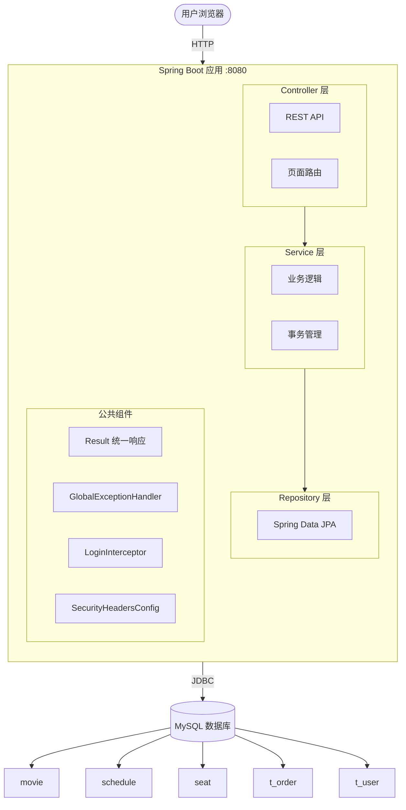
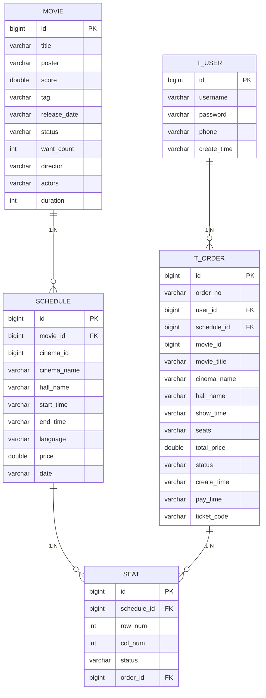
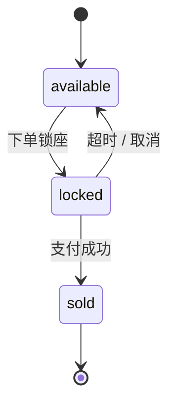
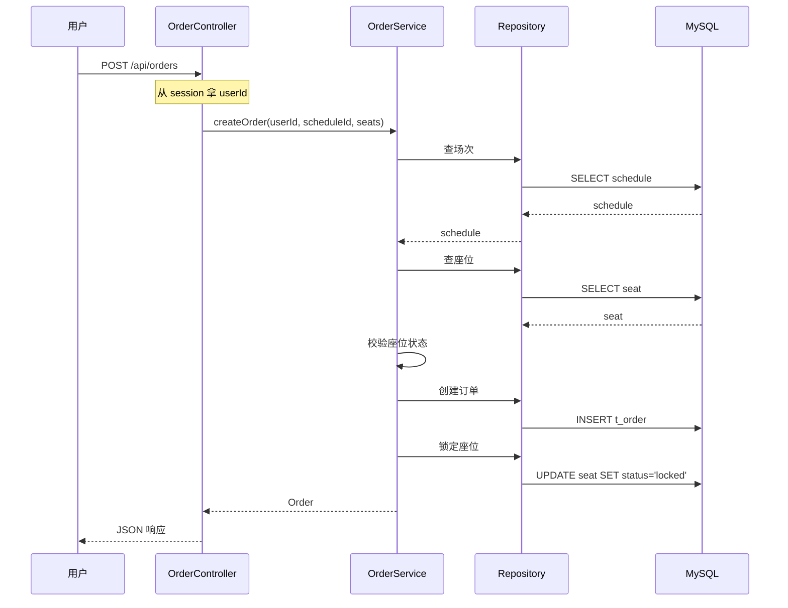

# 星幕影票 StarScreen Ticketing

> 一个基于 Spring Boot + Thymeleaf + MySQL 的电影票购买系统

## 📖 项目简介

星幕影票是一个完整的在线电影购票系统，支持用户浏览电影、选择场次、在线选座、下单支付、生成取票码的完整购票流程。系统还提供后台管理功能，管理员可以查看票房统计、管理电影和场次。

## ✨ 功能特性

### 用户端

- 🎬 **电影浏览**：正在热映、即将上映
- 🔍 **电影搜索**：按标题模糊搜索
- 🎭 **电影详情**：导演、主演、时长、剧情简介
- 🏢 **选影院场次**：多影院、多场次
- 💺 **可视化选座**：不同影厅不同布局（IMAX / 1号厅 / 2号厅 / 3号厅）
- 🛒 **锁座下单**：10 分钟超时自动释放
- 💳 **模拟支付**：生成取票码
- 📋 **订单管理**：按状态筛选（全部 / 待支付 / 已支付 / 已取消）
- 👤 **用户系统**：注册、登录、登出

### 管理端

- 📊 **数据概览**：订单总数、票房、热销 TOP5
- 📈 **票房趋势图**：ECharts 折线图 + 饼图
- 🎬 **电影管理**：增删改查
- 📅 **场次管理**：增删改查

## 🛠 技术栈

| 分类 | 技术 |
|---|---|
| **后端框架** | Spring Boot 3.5.17 |
| **持久层** | Spring Data JPA + Hibernate |
| **模板引擎** | Thymeleaf |
| **数据库** | MySQL 8.x |
| **前端** | 原生 HTML / CSS / JavaScript |
| **图表库** | ECharts 5.4.3 |
| **构建工具** | Maven |
| **JDK 版本** | Java 21 |

## 🏗 系统架构



## 🗄 数据库设计



## 🔄 座位状态机



## 📋 下单流程



## 📦 快速开始

### 1. 环境要求

- JDK 21+
- Maven 3.8+
- MySQL 8.0+

### 2. 建数据库

```sql
CREATE DATABASE movie_ticketing DEFAULT CHARACTER SET utf8mb4;
```

### 3. 修改配置

编辑 `src/main/resources/application.properties`：

```properties
spring.datasource.url=jdbc:mysql://localhost:3306/movie_ticketing?useUnicode=true&characterEncoding=utf8&serverTimezone=Asia/Shanghai
spring.datasource.username=root
spring.datasource.password=你的密码
```

### 4. 启动

```bash
mvn spring-boot:run
```

**或者**：

```bash
mvn clean package
java -jar target/starscreen-ticketing-1.0.0.jar
```

### 5. 访问

浏览器打开 `http://localhost:8080/`

首次启动会自动建表 + 初始化 16 部电影、场次、座位数据。

### 6. 测试账号

| 用户名 | 密码 |
|---|---|
| alice | 123456 |
| bob | 123456 |

## 📁 项目结构

```
src/main/java/com/starscreen/
├── common/                     公共类
│   ├── Result.java             统一响应
│   ├── BusinessException       业务异常
│   └── GlobalExceptionHandler  全局异常处理
├── config/                     配置
│   ├── DataInitializer         数据初始化
│   ├── CorsConfig              CORS 白名单
│   ├── SecurityHeadersConfig   安全响应头
│   ├── LoginInterceptor        登录拦截器
│   └── WebConfig               拦截器注册
├── controller/                 控制器
│   ├── MovieController         电影 API
│   ├── OrderController         订单 API
│   ├── SeatController          座位 API
│   ├── UserController          用户 API
│   ├── AdminMovieController    电影管理 API
│   ├── AdminScheduleController 场次管理 API
│   └── PageController          页面路由
├── dto/                        数据传输对象
│   ├── CreateOrderRequest      下单请求
│   ├── SeatVO                  座位 VO
│   ├── UserVO                  用户 VO
│   ├── LoginRequest            登录请求
│   └── RegisterRequest         注册请求
├── entity/                     JPA 实体
│   ├── Movie
│   ├── Schedule
│   ├── Seat
│   ├── Order
│   └── User
├── repository/                 数据访问
│   ├── MovieRepository
│   ├── ScheduleRepository
│   ├── SeatRepository
│   ├── OrderRepository
│   └── UserRepository
└── service/                    业务逻辑
    ├── MovieService
    ├── OrderService
    ├── SeatService
    ├── UserService
    ├── ScheduleService
    └── AdminService
```

## 🔐 安全性

| 防护 | 实现 |
|---|---|
| **SQL 注入** | JPA 参数化查询 |
| **XSS** | Thymeleaf 自动转义 |
| **越权** | session userId 校验 |
| **CORS** | 白名单限制 |
| **安全头** | CSP / X-Frame-Options / X-Content-Type-Options |
| **异常处理** | 全局异常统一返回 |
| **参数校验** | @Valid + @NotNull / @Size |

## 📊 性能

JMeter 压力测试结果（1000 并发 × 10 循环 = 10000 请求）：

| 指标 | 值 |
|---|---|
| **QPS** | 953 |
| **平均响应** | 723ms |
| **99% 百分位** | 1087ms |
| **错误率** | 0.00% |

## 🎯 核心设计

### 1. 事务保证数据一致性

```java
@Transactional
public Order createOrder(Long userId, Long scheduleId, List<String> seatLabels) {
    // 1. 校验座位
    // 2. 创建订单
    // 3. 锁定座位
    // 任何一步失败 → 全部回滚
}
```

### 2. 定时任务释放超时订单

```java
@Scheduled(fixedRate = 30_000)
public void cancelExpiredOrders() {
    // 每 30 秒扫描一次
    // 超过 10 分钟的 pending 订单 → cancelled
    // 释放座位
}
```

### 3. 用户隔离

- **下单**：从 session 拿 userId，用户无法伪造
- **查订单**：校验 userId 匹配
- **支付 / 取消**：校验 userId 匹配

## 📸 项目截图

> 截图放在 `docs/images/` 目录

### 首页


### 电影详情


### 选座页


### 支付页


### 取票码


### 我的订单


### 后台统计


### ECharts 图表


## 📄 License

MIT License

---

**Made with ❤️ by XieKun**