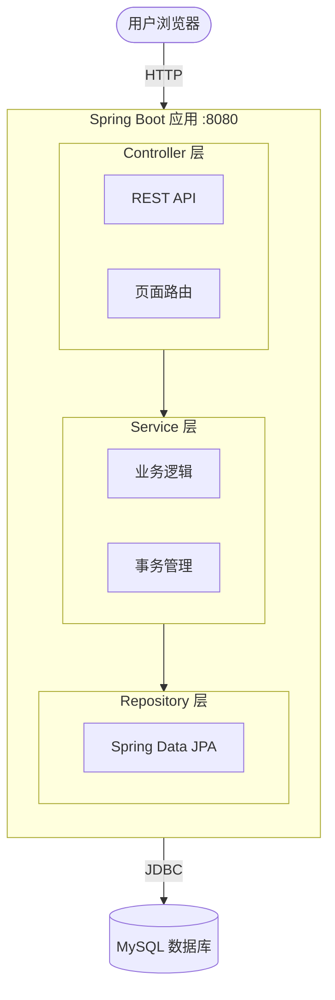
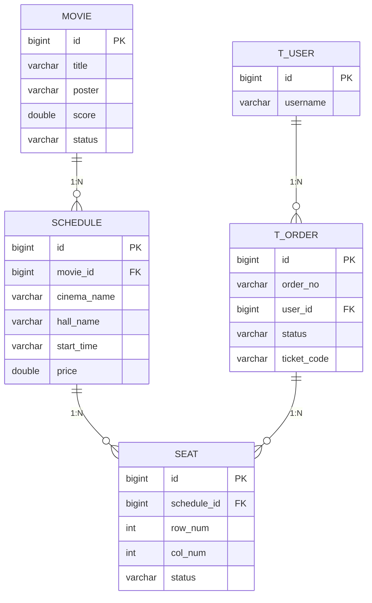

# 星幕影票 StarScreen Ticketing

基于 Spring Boot + Thymeleaf + MySQL 的电影购票系统。

## 技术栈

- Spring Boot 3.2.5
- Spring Data JPA
- Thymeleaf
- MySQL 8.x
- Maven
- JDK 21

## 功能

- 电影列表（正在热映 / 即将上映）
- 电影详情
- 选影院、选场次
- 选座（座位图可视化，不同影厅不同布局）
- 锁座下单（10 分钟超时自动释放）
- 模拟支付
- 生成取票码
- 订单列表（按状态筛选）
- 后台统计（订单数、票房、热销 TOP5）

## 快速开始

### 1. 建数据库

```sql
CREATE DATABASE movie_ticketing DEFAULT CHARACTER SET utf8mb4;
```

### 2. 修改配置

编辑 `src/main/resources/application.properties` 中的数据库账号密码。

### 3. 启动

```bash
mvn spring-boot:run
```

### 4. 访问

浏览器打开 `http://localhost:8080/`

## 项目结构

```
src/main/java/com/starscreen/
├── common/             公共类（统一响应、异常处理）
├── config/             配置
├── controller/         控制器（REST + 页面路由）
├── dto/                数据传输对象
├── entity/             JPA 实体
├── repository/         数据访问层
└── service/            业务逻辑层
```

## License

MIT# 猫眼电影购票系统

基于 Spring Boot + Thymeleaf + MySQL 的电影购票系统。

## 技术栈

- Spring Boot 3.2.5
- Spring Data JPA
- Thymeleaf
- MySQL 8.x
- Maven
- JDK 21

## 功能

- 电影列表（正在热映 / 即将上映）
- 电影详情
- 选影院、选场次
- 选座（座位图可视化）
- 锁座下单（10 分钟超时自动释放）
- 模拟支付
- 生成取票码
- 订单列表 / 票券查看

## 快速开始

### 1. 建数据库

\`\`\`sql
CREATE DATABASE movie_ticketing DEFAULT CHARACTER SET utf8mb4;
\`\`\`

### 2. 修改配置

编辑 `src/main/resources/application.properties` 中的数据库账号密码。

### 3. 启动

\`\`\`bash
mvn spring-boot:run
\`\`\`

### 4. 访问

浏览器打开 `http://localhost:8080/`

## 项目结构

\`\`\`
src/main/java/com/maoyan/
├── common/             公共类（统一响应、异常处理）
├── config/             配置
├── controller/         控制器
├── dto/                数据传输对象
├── entity/             JPA 实体
├── repository/         数据访问层
└── service/            业务逻辑层
\`\`\`

## License

MIT
\`\`\`

然后提交：

```bash
git add README.md
git commit -m "docs: 添加项目 README"
git push

## 🏗 系统架构



## 🗄 数据库设计



## 🔄 座位状态机

```mermaid
stateDiagram-v2
    [*] --> available
    available --> locked : 下单锁座
    locked --> sold : 支付成功
    locked --> available : 超时/取消
    sold --> [*]
## 📋 下单流程

```mermaid
sequenceDiagram
    participant U as 用户
    participant C as OrderController
    participant S as OrderService
    participant R as Repository
    participant DB as MySQL
    
    U->>C: POST /api/orders
    Note over C: 从 session 拿 userId
    C->>S: createOrder(userId, scheduleId, seats)
    S->>R: 查场次
    R->>DB: SELECT schedule
    DB-->>R: schedule
    R-->>S: schedule
    S->>R: 查座位
    R->>DB: SELECT seat
    DB-->>R: seat
    S->>S: 校验座位状态
    S->>R: 创建订单
    R->>DB: INSERT t_order
    S->>R: 锁定座位
    R->>DB: UPDATE seat SET status='locked'
    S-->>C: Order
    C-->>U: JSON 响应
```
```